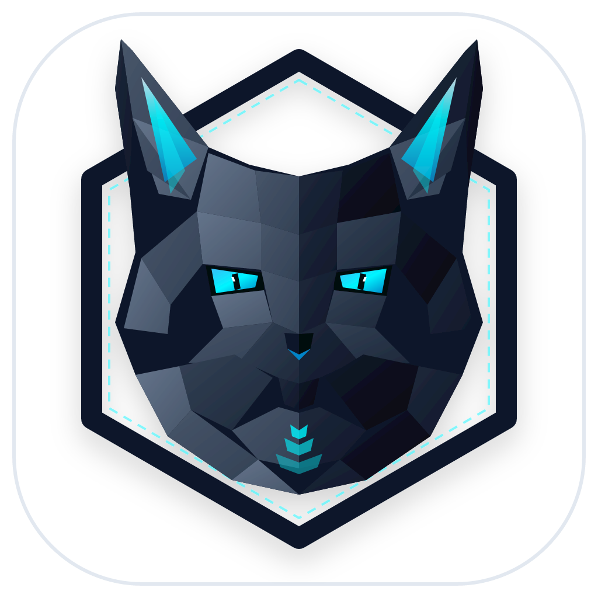
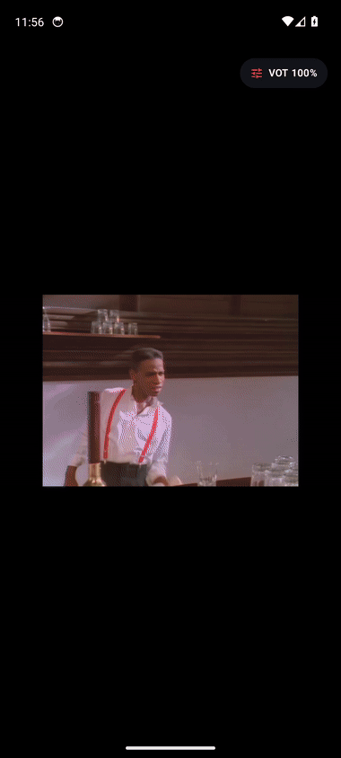
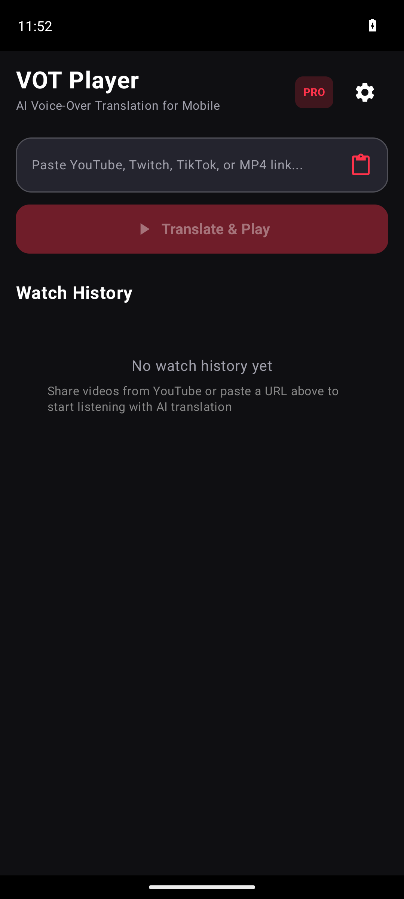
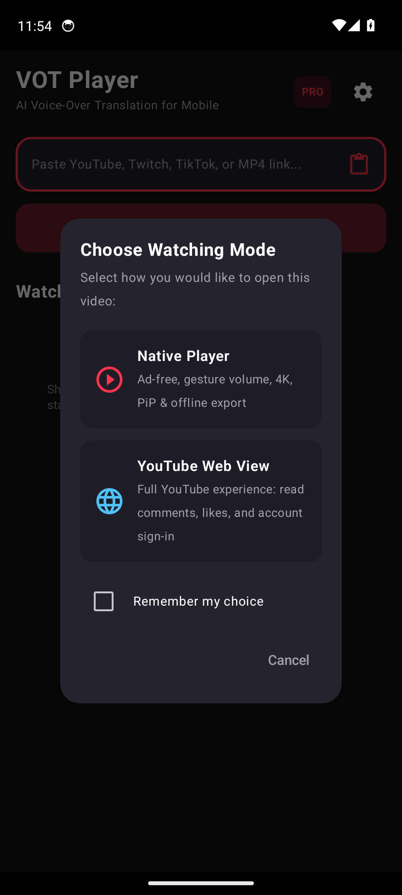
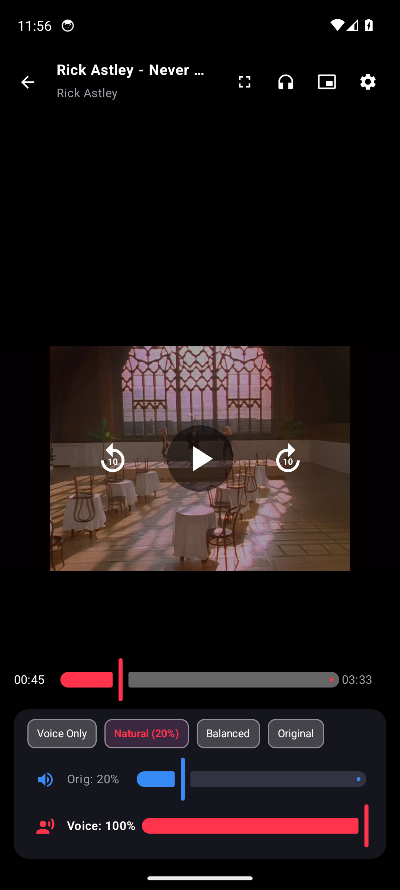
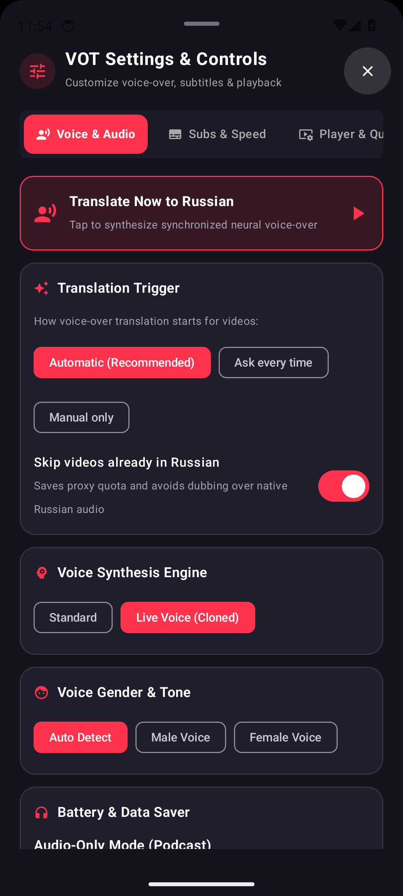

<p align="center">
  
</p>

<h1 align="center">VOT Player for Android</h1>

<p align="center">
  <b>Android video player with real-time neural Voice-Over Translation (VOT) from English to Russian and synchronized multilingual subtitles.</b>
</p>

<p align="center">
  
  
  
  
  
</p>

<p align="center">
  
</p>

---

## Overview

VOT Player is an ad-free Android player designed for watching English videos with synchronized Russian voiceover dubbing. Built on the open-source [voice-over-translation](https://github.com/ilyhalight/voice-over-translation) protocol, the application queries neural speech synthesis backends and streams the translated audio track alongside the original video with millisecond clock alignment.

It includes dedicated proxy fallbacks, subtitle extraction for Russian, Romanian, and English, SponsorBlock skipping, offline export to MP4/MP3, and a choice between native hardware-accelerated playback and an integrated YouTube web view.

---

## Interface & Screenshots

| Home & History | Mode Selection | Video Player | Settings & Controls |
| :---: | :---: | :---: | :---: |
|  |  |  |  |
| *Clipboard URL detection & watch history* | *Choose Native Player or YouTube Web View* | *Live video with audio balance controls* | *Trigger modes, voice actors & skip Russian* |

---

## Core Translation Features

### 1. English to Russian Neural Voiceover
- **Synchronized Audio Dubbing**: Plays video streams alongside neural Russian voiceover tracks with automatic clock drift compensation and volume ducking.
- **Two Voice Synthesis Engines**:
  - **Standard Voices**: Stable neural synthesis with selectable voice genders (Male, Female, Auto) and distinct voice actors (**Filipp**, **Ermil**, **Madirus**, **Alena**, **Oksana**, **Jane**).
  - **Live Voices**: Neural synthesis configured for conversational speech, dynamic pacing, and natural sentence pauses.
- **Independent Audio Mixing**: Sliders for original audio (0–100%) and translated voiceover (0–100%), with quick presets for Voice Only, Natural (20% original), Balanced (50%), and Original (100%).

### 2. Synchronized Subtitles (RU, RO, EN)
- **Russian Subtitles (RU)**: Generated from the neural translation alignment pipeline.
- **Romanian Subtitles (RO)**: Translated subtitle stream delivered through worker proxies to bypass YouTube IP rate limits.
- **English Original (EN)**: Extracted directly from official timedtext caption tracks.
- **Quick Switching**: Toggle between off, Russian, Romanian, and English directly from the player bottom sheet.

### 3. Translation Trigger Modes
- **Automatic (`ALWAYS_AUTO`)**: Translation starts immediately when a video opens.
- **Ask Every Time (`ASK_EVERY_TIME`)**: Shows a prompt on video start (`Translate to Russian? [Translate] [Keep Original]`). Playback begins immediately without waiting.
- **Manual Only (`MANUAL`)**: The video plays in its original language. Translation can be triggered at any time using the **Translate Now** button.
- **Skip Videos Already in Russian (`autoSkipRussianVideos`)**: Inspects video title and creator metadata for Cyrillic character density. If a video is already in Russian, voiceover synthesis is skipped to prevent duplicate audio and preserve proxy quota. Subtitles remain available.

---

## Player Capabilities

- **Dual Playback Modes**:
  - **Native Player (ExoPlayer / Media3)**: Hardware-accelerated DASH and HLS playback up to 4K 60fps, touch gestures for brightness and volume, and Picture-in-Picture (PiP).
  - **YouTube Web View**: Mobile web interface with synchronized voiceover overlay, preserving comments, recommendations, and Google account sign-in.
- **SponsorBlock**: Automatically skips sponsored segments, intros, and interaction reminders using the crowd-sourced SponsorBlock API.
- **Offline Export**:
  - **Export Video (MP4)**: Multiplexes high-resolution video streams and the Russian translated audio track into an MP4 file in `Downloads/VOT`.
  - **Export Audio (MP3)**: Saves the voiceover track as an MP3 file in `Music/VOT` for podcast-style listening.
- **Audio-Only Mode**: Shuts off video decoding to conserve battery and mobile data during background listening.
- **Watch History & Resume**: Local SQLite database saves playback position, video duration, and volume configurations.
- **In-App Updater**: Checks GitHub releases for new builds and handles APK installation directly.
- **System Integration**: Accepts shared URLs from YouTube, Twitter/X, Reddit, TikTok, and web browsers via Android's share sheet and clipboard detection.

---

## Brand & Mascot

<p align="center">
  
</p>

The project mascot is the **Acoustic Fennec Fox**. Known for its large directional ears capable of locating faint sounds across desert sands, the fennec fox represents acoustic precision in VOT Player: isolating speech in foreign audio streams, routing it through neural synthesis pipelines, and delivering synchronized translations in real time.

---

## Architecture

```
com.vot.player/
├── data/
│   ├── db/              # SQLiteOpenHelper WatchHistoryDatabase
│   ├── extractor/       # MultiPlatformExtractor (YouTube, Twitch, TikTok, direct URLs)
│   ├── model/           # UniversalVideoInfo, SubtitleCue, VoiceType
│   ├── pref/            # PlayerPreferences (Trigger modes, player modes, audio defaults)
│   ├── sponsorblock/    # SponsorBlockClient for skip segment queries
│   ├── update/          # UpdateChecker for GitHub Releases APK downloads
│   ├── vot/             # VotApiClient, binary Protobuf serializer, HMAC-SHA256 signing
│   └── youtube/         # YouTubeStreamExtractor using InnerTube endpoints
├── export/              # VotExportManager (downloading & multiplexing MP4/MP3)
├── player/              # VotPlayerManager (dual ExoPlayer instances, clock sync, ducking)
├── service/             # VotMediaService (MediaSession, persistent notification, lockscreen controls)
└── ui/
    ├── components/      # SettingsBottomSheet, SettingsDialog, PlayerModeDialog, Gestures
    ├── theme/           # Dark AMOLED styling, typography, colors
    ├── HistoryScreen.kt # Home screen with URL input, watch history, and clipboard listener
    ├── PlayerScreen.kt  # Native ExoPlayer surface with on-screen HUD and translate prompt
    └── YouTubeWebScreen.kt # Web player with floating VOT translation controls
```

### Security & Protocol Handling
- **Binary Protobuf Serialization**: Translates requests into binary protocol buffer payloads required by Yandex translation endpoints.
- **HMAC-SHA256 Request Signing**: Generates cryptographic `Vtrans-Signature` headers for outgoing requests.
- **Proxy Failover**: Automatically rotates across Cloudflare worker proxies (`vot-worker.vtrans.eu.cc`, `vot-worker.eu.cc`) when upstream rate limits occur.

---

## Requirements

- **Android Version**: Android 8.0 (API level 26) or higher
- **Target SDK**: Android 35
- **JDK**: Java 17 or Java 21
- **Build System**: Gradle 8.12 (wrapper included)

---

## Building from Source

```bash
git clone https://github.com/alexandrmotologa/vot-android-player.git
cd vot-android-player
./gradlew assembleDebug
```

The output APK will be located at:
```
app/build/outputs/apk/debug/app-debug.apk
```

To compile a release APK:
```bash
./gradlew assembleRelease
```

---

## Credits & Acknowledgments

- [voice-over-translation](https://github.com/ilyhalight/voice-over-translation) by ilyhalight for reverse-engineering the Yandex VOT protocol.
- [SponsorBlock](https://sponsor.ajay.app/) for crowd-sourced sponsor segment skipping.
- [ExoPlayer / Media3](https://github.com/androidx/media) for native playback primitives.

---

## License

MIT License. See [LICENSE](LICENSE) for details.
